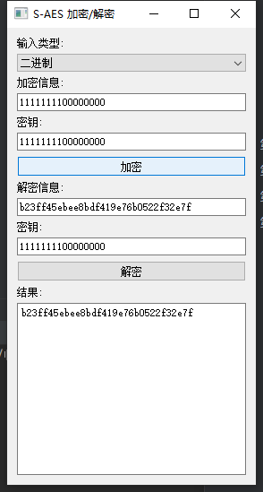
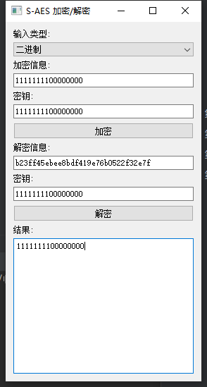
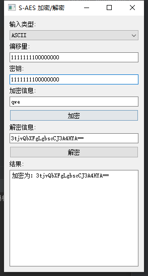
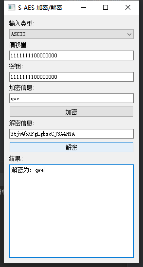
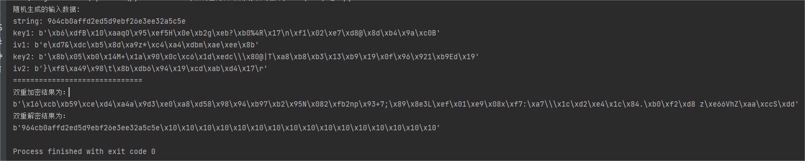
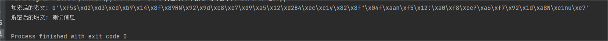

### 第1关：基本测试

根据S-AES算法编写和调试程序，提供GUI解密支持用户交互。输入可以是16bit的数据和16bit的密钥，输出是16bit的密文。

代码

#### gui.py  图形化界面代码实现

```python
# -*- coding: utf-8 -*-
# @Time : 2023/10/30 8:38
# @Author : hungry_xd
# @File : gui2
# @Project : SAES

from PyQt5.QtWidgets import QApplication, QWidget, QVBoxLayout, QPushButton, QTextEdit, QLineEdit, QLabel, QComboBox
from src_func import *
class MyApp(QWidget):
    def __init__(self):
        super().__init__()

        self.input_type = QComboBox()
        self.input_type.addItem("二进制")
        self.input_type.addItem("ASCII")

        self.encrypt_text = QLineEdit()
        self.encrypt_key = QLineEdit()
        self.decrypt_text = QLineEdit()
        self.decrypt_key = QLineEdit()
        self.result_box = QTextEdit()

        self.init_ui()

    def init_ui(self):
        layout = QVBoxLayout()

        layout.addWidget(QLabel("输入类型:"))
        layout.addWidget(self.input_type)

        layout.addWidget(QLabel("加密信息:"))
        layout.addWidget(self.encrypt_text)
        layout.addWidget(QLabel("密钥:"))
        layout.addWidget(self.encrypt_key)
        encrypt_button = QPushButton("加密")
        encrypt_button.clicked.connect(self.encrypt)
        layout.addWidget(encrypt_button)

        layout.addWidget(QLabel("解密信息:"))
        layout.addWidget(self.decrypt_text)
        layout.addWidget(QLabel("密钥:"))
        layout.addWidget(self.decrypt_key)
        decrypt_button = QPushButton('解密')
        decrypt_button.clicked.connect(self.decrypt)
        layout.addWidget(decrypt_button)

        layout.addWidget(QLabel("结果:"))
        layout.addWidget(self.result_box)

        self.setLayout(layout)
        self.setWindowTitle('S-DES Encryptor/Decryptor')
        self.show()

    def encrypt(self):
        plaintext = self.encrypt_text.text()
        key = self.encrypt_key.text()

        aes = AES128(key)
        ciphertext = aes.encrypto(plaintext)
        self.result_box.setText(ciphertext)

    def decrypt(self):
        ciphertext = self.decrypt_text.text()
        key = self.decrypt_key.text()

        aes = AES128(key)
        plaintext = aes.decrypto(ciphertext)
        self.result_box.setText(plaintext.decode('utf-8'))


if __name__ == '__main__':
    import sys
    app = QApplication(sys.argv)
    ex = MyApp()
    sys.exit(app.exec_())

```

#### 


#### src_func.py 核心代码函数实现

```python
# 定义置换表和S盒
P10 = [3,5,2,7,4,10,1,9,8,6]
P8 = [6,3,7,4,8,5,10,9]
IP = [2,6,3,1,4,8,5,7]
IP_inverse = [4,1,3,5,7,2,8,6]
E_P = [4,1,2,3,2,3,4,1]
P4 = [2,4,3,1]
S0 = [[1,0,3,2],[3,2,1,0],[0,2,1,3],[3,1,0,2]]
S1 = [[0,1,2,3],[2,0,1,3],[3,0,1,2],[2,1,0,3]]

# 置换函数
def permute(k, arr, n):
    per = []
    for i in range(0,n):
        per.append(k[arr[i]-1])  # 根据arr中的位置信息进行置换
    return per

# 左移函数
def shift(l, n):
    s = l[n:] + l[:n]  # 左移n位
    return s

# 密钥生成函数
def keygen(key):
    key = permute(key, P10, 10)  # 第一次置换
    key = shift(key, 1)  # 左移
    key1 = permute(key, P8, 8)  # 第二次置换得到K1
    key = shift(key, 2)  # 再次左移
    key2 = permute(key, P8, 8)  # 第三次置换得到K2
    return key1, key2

# 轮函数F
def F(R, key):
    t = permute(R, E_P, 8)  # 扩展置换
    t = [t[i] ^ key[i] for i in range(8)]  # 与子密钥异或
    t = t[:4], t[4:]  # 分为两半
    row = int(str(t[0][0])+str(t[0][3]),2)  # 计算S盒的行
    col = int(''.join([str(x) for x in t[0][1:3]]),2)  # 计算S盒的列
    val = bin(S0[row][col])[2:].zfill(2)  # 从S盒中获取值
    row = int(str(t[1][0])+str(t[1][3]),2)
    col = int(''.join([str(x) for x in t[1][1:3]]),2)
    val += bin(S1[row][col])[2:].zfill(2)
    val = [int(x) for x in str(val)]
    val = permute(val, P4, 4)  # P4置换
    return val


# 加密函数
def encrypt(pt, keys):
    pt = permute(pt, IP, 8)  # 初始置换
    L, R = pt[:4], pt[4:]  # 分为左右两半
    temp = R
    # 计算轮函数F的结果，然后再与左半部分异或
    f = F(temp, keys[0])
    L = [L[i] ^ f[i] for i in range(4)]
    # 交换左右两部分
    L, R = R, L
    temp = R
    # 计算轮函数F的结果，然后再与左半部分异或
    f = F(temp, keys[1])
    L = [L[i] ^ f[i] for i in range(4)]
    pt = permute(L+R, IP_inverse, 8)  # 进行逆初始置换
    return pt

# 解密函数
def decrypt(pt, keys):
    pt = permute(pt, IP, 8)  # 初始置换
    L, R = pt[:4], pt[4:]  # 分为左右两半
    temp = R
    # 计算轮函数F的结果，然后再与左半部分异或
    f = F(temp, keys[1])
    L = [L[i] ^ f[i] for i in range(4)]
    # 交换左右两部分
    L, R = R, L
    temp = R
    # 计算轮函数F的结果，然后再与左半部分异或
    f = F(temp, keys[0])
    L = [L[i] ^ f[i] for i in range(4)]
    pt = permute(L+R, IP_inverse, 8)  # 进行逆初始置换
    return pt

def ascii_to_bin(text):
    return ''.join(format(ord(c), '08b') for c in text)

def bin_to_ascii(binary):
    return ''.join(chr(int(binary[i:i+8], 2)) for i in range(0, len(binary), 8))


if __name__ == '__main__':

    # 测试
    key = '1010000010'
    pt = '01110010'
    key = [int(i) for i in key]
    pt = [int(i) for i in pt]
    keys = keygen(key)  # 生成子密钥K1和K2
    cipher = encrypt(pt, keys)  # 加密
    print('加密结果: ', ''.join([str(i) for i in cipher]))
    plain = decrypt(cipher, keys)  # 解密
    print('解密结果: ', ''.join([str(i) for i in plain]))

```


#### 测试

16bit的数据加解密功能


#### 测试记录

密钥1111111100000000

加密信息1111111100000000

加密结果: b23ff45ebee8bdf419e76b0522f32e7f

解密结果: 1111111100000000







通过测试


### 第2关：交叉测试


交叉测试结果与上一关中的结果相同


### 第3关：扩展功能

考虑到向实用性扩展，加密算法的数据输入可以是ASII编码字符串(分组为2 Bytes)，对应地输出也可以是ACII字符串(很可能是乱码)。


加密信息:qwe

密钥:1110011111100111

偏移量: 1110011111100111

加密结果: RK4joPmZKoa8JPz+hQbVJQ==

解密结果: qwe








通过测试

### 第4关：多重加密

#### 1.双重加密

将S-AES算法通过双重加密进行扩展，分组长度仍然是16 bits，但密钥长度为32 bits。

测试结果




```
随机生成的输入数据:
string: 964cb0affd2ed5d9ebf26e3ee32a5c5e
key1: b'\xb6\xdfB\x10\xaaqO\x95\xef5H\x0e\xb2g\xeb?\xb0%4R\x17\n\xf1\x02\xe7\xd8@\x8d\xb4\x9a\xc0B'
iv1: b'e\xd7&\xdc\xb5\x8d\xa9z*\xc4\xa4\xdbm\xae\xee\x8b'
key2: b'\x8b\x05\xb0\x14M+\x1a\x90\x0c\xc6\x1d\xedc\\\x80@|T\xa8\xb8\xb3\x13\xb9\x19\x0f\x96\x921\xb9Ed\x19'
iv2: b'}\xf8\xa49\x98\t\x8b\xdb6\x94\x19\xcd\xab\xd4\x17\r'
==============================
双重加密结果为：
b'\x16\xcb\xb59\xce\xd4\xa4a\x9d3\xe0\xa8\xd58\x98\x94\xb97\xb2\x95N\x082\xfb2np\x93+7;\x89\x8e3L\xef\x01\xe9\x08x\xf7:\xa7\\\x1c\xd2\xe4\x1c\x84.\xb0\xf2\xd8 z\xe66VhZ\xaa\xccS\xdd'
双重解密结果为：
b'964cb0affd2ed5d9ebf26e3ee32a5c5e\x10\x10\x10\x10\x10\x10\x10\x10\x10\x10\x10\x10\x10\x10\x10\x10'
```

代码


```python
# -*- coding: utf-8 -*-
# @Time : 2023/10/30 9:25
# @Author : hungry_xd
# @File : 4_1
# @Project : SAES
from Crypto.Cipher import AES


def encrypt(string, key1, iv1, key2, iv2):
    cipher1 = AES.new(key1, AES.MODE_CBC, iv1)
    x = AES.block_size - (len(string) % AES.block_size)
    if x != 0:
        string = string + chr(x) * x
    msg1 = cipher1.encrypt(string.encode('utf-8'))

    cipher2 = AES.new(key2, AES.MODE_CBC, iv2)
    x2 = AES.block_size - (len(msg1) % AES.block_size)
    if x2 != 0:
        msg1 = msg1 + bytes([x2]) * x2
    msg2 = cipher2.encrypt(msg1)

    return msg2


def decrypt(en_str, key2, iv2, key1, iv1):
    cipher2 = AES.new(key2, AES.MODE_CBC, iv2)
    msg1 = cipher2.decrypt(en_str)

    padding_len = msg1[-1]
    msg1 = msg1[:-padding_len]

    cipher1 = AES.new(key1, AES.MODE_CBC, iv1)
    msg = cipher1.decrypt(msg1)

    return msg


if __name__ == "__main__":
    import secrets

    infor = secrets.token_hex(16)  # 生成一个随机的 16 字节字符串
    key1 = secrets.token_bytes(32)  # 生成一个随机的 32 字节密钥
    iv1 = secrets.token_bytes(16)  # 生成一个随机的 16 字节初始化向量
    key2 = secrets.token_bytes(32)  # 生成一个随机的 32 字节密钥
    iv2 = secrets.token_bytes(16)  # 生成一个随机的 16 字节初始化向量
    print("随机生成的输入数据:")
    print("string:", infor)
    print("key1:", key1)
    print("iv1:", iv1)
    print("key2:", key2)
    print("iv2:", iv2)

    print("="*30)


    res = encrypt(infor, key1, iv1, key2, iv2)
    print('双重加密结果为：')
    print(res)
    print("双重解密结果为：")
    print(decrypt(res, key2, iv2, key1, iv1))

```


#### 2.中间相遇攻击

假设你找到了使用相同密钥的明、密文对(一个或多个)，请尝试使用中间相遇攻击的方法找到正确的密钥Key(K1+K2)。

#### 3.三重加密

使用48bits(K1+K2+K3)的模式进行三重加解密。

测试结果




```
加密后的密文: b'\xf5s\xd2\xd3\xed\xb9\x14\x8f\x89RN\x92\x9d\xc8\xe7\xd9\xa5\x12\xd2B4\xec\xc1y\x82\x8f"\x04f\xaan\xf5\x12:\xa0\xf8\xce?\xa6\xf7\x92\x1d\xa8N\xc1nu\xc7'
解密后的明文: 测试信息

```


```python

def triple_encrypt(plaintext, keys):
    ciphertext = plaintext
    for key in keys:
        cipher = AES.new(key, AES.MODE_ECB)
        ciphertext = cipher.encrypt(pad(ciphertext, AES.block_size))
    return ciphertext

def triple_decrypt(ciphertext, keys):
    plaintext = ciphertext
    for key in reversed(keys):
        cipher = AES.new(key, AES.MODE_ECB)
        plaintext = unpad(cipher.decrypt(plaintext), AES.block_size)
    return plaintext

# 示例使用的密钥列表
keys = [b'K1'*8, b'K2'*8, b'K3'*8]

# 待加密的明文
plaintext = '测试信息'.encode('utf-8')


# 加密
ciphertext = triple_encrypt(plaintext, keys)
print('加密后的密文:', ciphertext)

# 解密
decrypted_text = triple_decrypt(ciphertext, keys)
print('解密后的明文:', decrypted_text.decode())

```


### 第5关：工作模式


```python

# 原始密文和密钥
original_ciphertext = "RK4joPmZKoa8JPz+hQbVJQ=="
key = "1110011111100111"
iv = "1110011111100111"


# 解密原始密文
def decrypt_cbc(ciphertext, key, iv):
    cipher = AES.new(key.encode("utf-8"), AES.MODE_CBC, iv.encode("utf-8"))
    plaintext = cipher.decrypt(base64.b64decode(ciphertext))
    return plaintext
# 输出原始密文的解密结果
original_plaintext = decrypt_cbc(original_ciphertext, key, iv)
print("原始密文:", original_plaintext)
#将第一个密文分组的第一个字节更改为0xFF
tampered_ciphertext = base64.b64decode(original_ciphertext)
tampered_ciphertext = bytearray(tampered_ciphertext)
tampered_ciphertext[0] = 0xFF
# 解密篡改后的密文
tampered_ciphertext = base64.b64encode(tampered_ciphertext).decode("utf-8")
tampered_plaintext = decrypt_cbc(tampered_ciphertext, key, iv)
print("修改分组后密文:", tampered_plaintext)

```

